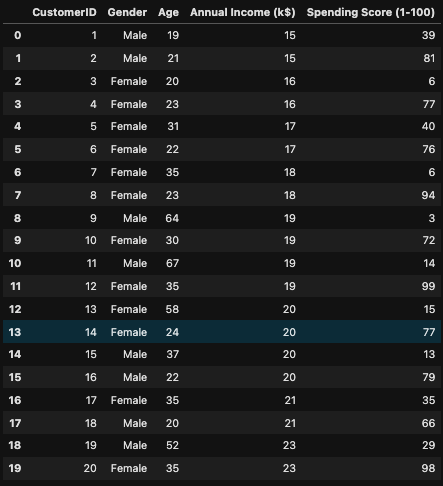
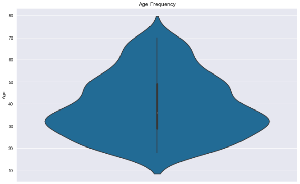
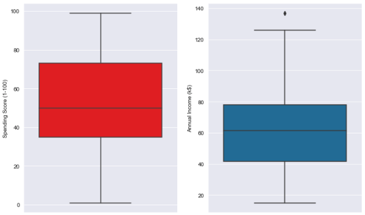
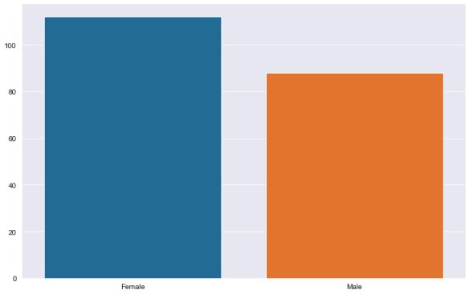
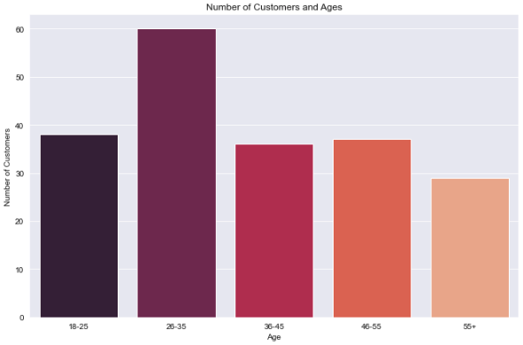
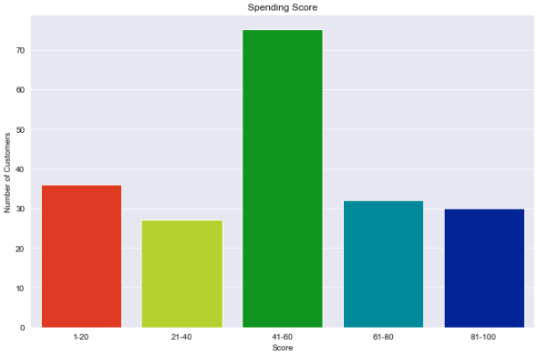
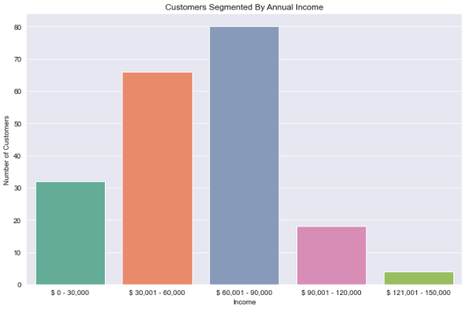
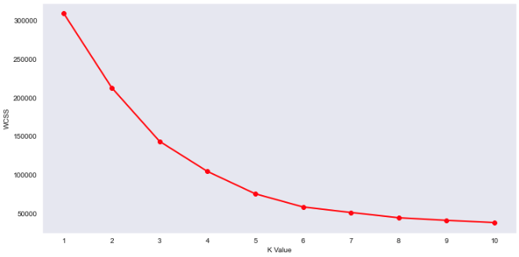
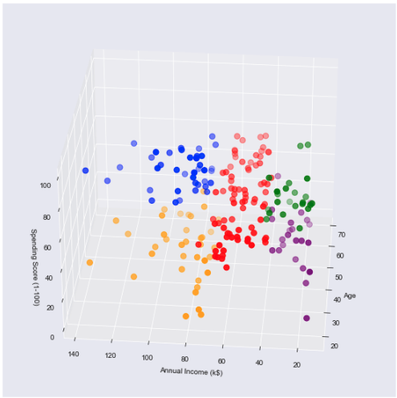

# Mall Customers Segmentation

### Dependencies used: 
* pandas
* numpy 
* seaborn 
* matplotlib.pyplot
* sklearn.cluster 

### Mall Customers DataFrame

### Visualizations 

##### Age Frequency Violin Graph

##### Annual Income and Spending Score Boxplot

##### Gender Barplots

##### Number of customers segmented by Age Group

##### Spending Score segmented by Age Group

##### Customers segmented by Annual Income

##### K Values

##### KMeans Cluster Diagram comparing Annual Income, Spending Score and Age

